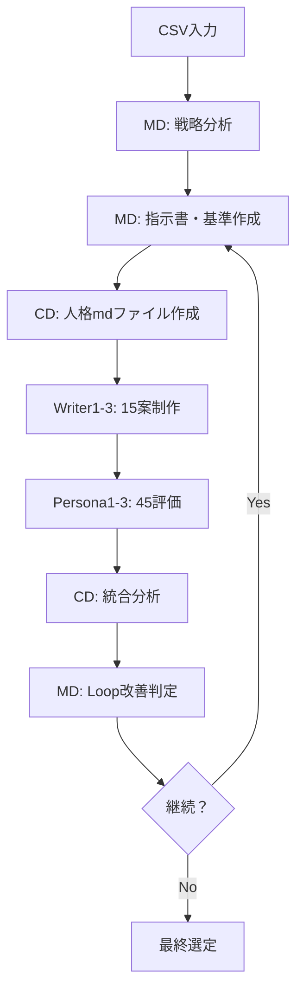

# 🤖 BB-Project: MDファイルベース仕様書

## システム概要
Claude Code Communications設計思想に基づく、8体のAIエージェント協調型台本作成システム。mdファイルベース管理による高効率・高品質な広告制作プラットフォームです。

## 🎯 新ワークフロー仕様（2024年12月更新）

### 革新的改善点
- **ループベース継続改善**: 品質向上の自動化サイクル
- **大量生産システム**: 15案並列制作体制
- **人格mdファイル**: ループごとの詳細エージェント定義
- **統合分析エンジン**: 45評価の包括的データ分析
- **チェーン式初期化**: ワンクリック全システム起動

## 🏗️ アーキテクチャ設計

### エージェント階層構造
```
📊 戦略層（MD）
    ↓ 指示書・評価基準作成
🎭 統括層（CD）
    ↓ 人格形成・品質管理
✍️ 制作層（Writer1-3）
    ↓ 大量台本制作
📋 評価層（Persona1-3）
    ↓ 多角的評価
📈 分析層（CD統合）
    ↓ 改善提案
🔄 改善層（MDループ管理）
```

### システム流れ図


## 🔄 詳細ワークフロー

### Phase 1: 戦略立案・分析フェーズ
**責任者**: MD (Marketing Director)

#### 1-1. CSV分析・商品理解
```bash
# 商品特徴・競合分析・市場ポジション分析
→ product_analysis.md
```

#### 1-2. ターゲット分析詳細書作成
```bash
# 年齢層別セグメント・行動パターン・購買動機分析
→ target_analysis.md
```

#### 1-3. ライター向け指示書作成
```bash
# 制作方針・訴求ポイント・トーン設定・5案制作指示
→ copywriter_instructions.md
# Loop2以降は前回評価を反映した改善指示
```

#### 1-4. ペルソナ評価基準作成
```bash
# 売れている台本3本から評価軸推定・100点配点基準
→ persona_evaluation_criteria.md
```

#### 1-5. 総合クリエイティブ戦略作成
```bash
# ブランドポジショニング・差別化戦略・表現方針確定
→ creative_strategy.md
```

### Phase 2: 人格形成・ファイル管理フェーズ
**責任者**: CD (Creative Director)

#### 2-1. Writer人格mdファイル作成
```bash
# copywriter_instructions.mdを各Writerの特性に翻訳
→ writer1_loop[N].md  # 感情訴求特化型人格
→ writer2_loop[N].md  # 論理訴求特化型人格  
→ writer3_loop[N].md  # カジュアル特化型人格
```

#### 2-2. Persona人格mdファイル作成
```bash
# persona_evaluation_criteria.mdを各Personaの視点で具体化
→ persona1_loop[N].md  # 30-50代主婦層評価者人格
→ persona2_loop[N].md  # 25-45代ビジネス層評価者人格
→ persona3_loop[N].md  # 18-30代Z世代評価者人格
```

### Phase 3: 大量制作フェーズ
**責任者**: Writer1-3

#### 3-1. 並列5案制作
```bash
# 各Writerが人格mdファイルに基づき5案制作
Writer1: writer1_台本[1-5]_loop[N].md  # 感情訴求型5案
Writer2: writer2_台本[1-5]_loop[N].md  # 論理訴求型5案
Writer3: writer3_台本[1-5]_loop[N].md  # カジュアル型5案
# 合計: 15案
```

#### 3-2. 制作方針別分化
- **Writer1**: ストーリー・共感・感動・家族愛・夢の5軸
- **Writer2**: データ・効能・比較・科学・ROIの5軸  
- **Writer3**: フレンドリー・テンポ・トレンド・SNS・ユーモアの5軸

### Phase 4: 多角評価フェーズ
**責任者**: Persona1-3

#### 4-1. 15案一括評価
```bash
# 各Personaが人格mdファイルに基づき全15案を100点満点評価
Persona1: persona1_evaluation_loop[N].md  # 主婦視点評価
Persona2: persona2_evaluation_loop[N].md  # ビジネス視点評価
Persona3: persona3_evaluation_loop[N].md  # Z世代視点評価
# 合計: 45評価
```

#### 4-2. 評価軸詳細
- **Persona1**: 共感性40点・親近感30点・購買意欲30点
- **Persona2**: 論理性40点・効率性30点・信頼性30点
- **Persona3**: トレンド性40点・SNS映え30点・話題性30点

### Phase 5: 統合分析フェーズ
**責任者**: CD (Creative Director)

#### 5-1. 包括的データ分析
```bash
→ integrated_analysis_loop[N].md
# 1. 15案総合スコア（3ペルソナ平均）
# 2. ペルソナ別評価傾向分析
# 3. Writer別パフォーマンス分析  
# 4. 高評価台本共通要素抽出
# 5. 改善ポイント特定
# 6. CDからの総合フィードバック
# 7. 次ループ改善提案
```

### Phase 6: ループ改善フェーズ
**責任者**: MD (Marketing Director)

#### 6-1. 指示書・基準進化
```bash
# 前回評価結果を分析し、指示書を改善
copywriter_instructions.md     # ライター向け改善指示更新
persona_evaluation_criteria.md # より精緻な評価基準に調整
creative_strategy.md           # 成功要因組み込み戦略更新
```

#### 6-2. 次ループ開始判定
- **継続条件**: 改善余地あり・品質向上見込み
- **終了条件**: 目標品質到達・コスト上限

## 📁 ファイル管理システム

### プロジェクト構造標準
```
projects/[プロジェクト名]/
├── 📊 CSV入力データ
│   └── *.csv
├── 📋 MD作成戦略ファイル
│   ├── product_analysis.md             # 商品分析結果
│   ├── target_analysis.md              # ターゲット分析詳細書
│   ├── copywriter_instructions.md      # ライター向け指示書
│   ├── persona_evaluation_criteria.md  # ペルソナ評価基準
│   └── creative_strategy.md            # 総合クリエイティブ戦略
├── 📁 loop1/                           # Loop1成果物
│   ├── 👥 人格定義ファイル
│   │   ├── writer1_loop1.md
│   │   ├── writer2_loop1.md
│   │   ├── writer3_loop1.md
│   │   ├── persona1_loop1.md
│   │   ├── persona2_loop1.md
│   │   └── persona3_loop1.md
│   ├── 📝 台本ファイル（15案）
│   │   ├── writer1_台本1_loop1.md
│   │   ├── writer1_台本2_loop1.md
│   │   ├── writer1_台本3_loop1.md
│   │   ├── writer1_台本4_loop1.md
│   │   ├── writer1_台本5_loop1.md
│   │   ├── writer2_台本1_loop1.md
│   │   └── ... (全15案)
│   ├── 📊 評価ファイル
│   │   ├── persona1_evaluation_loop1.md
│   │   ├── persona2_evaluation_loop1.md
│   │   └── persona3_evaluation_loop1.md
│   └── 📈 統合分析
│       └── integrated_analysis_loop1.md
├── 📁 loop2/                           # Loop2成果物
└── 📁 loop3/                           # Loop3成果物
```

## 🎭 エージェント詳細仕様

### MD (Marketing Director)
- **主要機能**: 戦略立案・分析・指示書作成・ループ管理
- **入力**: CSVデータ・前回評価結果
- **出力**: 5種戦略ファイル・CD指示
- **特徴**: データ分析力・戦略策定力・継続改善力

### CD (Creative Director)  
- **主要機能**: 人格形成・制作統括・品質管理・評価統合
- **入力**: MD戦略ファイル・Writer成果・Persona評価
- **出力**: 6種人格mdファイル・統合分析・MD報告
- **特徴**: 統括力・品質保証・分析統合力

### Writer1-3
- **主要機能**: 各5案台本制作（計15案）
- **入力**: 人格mdファイル
- **出力**: 各5案台本ファイル
- **特徴**: 専門性特化・大量制作・品質一貫性

### Persona1-3
- **主要機能**: 15案×100点満点評価（計45評価）
- **入力**: 15案台本・人格mdファイル・評価基準
- **出力**: 詳細評価レポート
- **特徴**: 視点多様性・評価精度・フィードバック力

## 🚀 起動・操作システム

### チェーン式初期化
```bash
# ユーザー操作（MDで1回のみ）
"あなたはMDです。指示書に従って"

# 自動チェーン発動
MD → CD → Writer1-3 → Persona1-3
↓
全8エージェント初期化完了
```

### プロジェクト実行
```bash
# プロジェクト開始宣言
"プロジェクト名『[プロジェクト名]』でCSVデータを分析してloop1を開始してください"

# 自動実行チェーン
MD戦略分析 → CD人格形成 → Writer制作 → Persona評価 → CD統合 → MD改善判定
```

## 📊 性能・品質指標

### 制作能力
- **制作速度**: 15案並列制作
- **評価精度**: 3視点×100点満点×15案 = 45評価
- **改善効率**: ループごとの継続的品質向上

### システム効率
- **初期化**: 8回手動 → 1回自動（87.5%削減）
- **制作量**: 9案 → 15案（66.7%増加）
- **管理性**: Pythonベース → mdファイルベース（保守性向上）

### 品質保証
- **継続改善**: ループベース学習システム
- **多角評価**: 3ペルソナによる偏り防止
- **統合分析**: CDによる客観的品質判定

## 🔧 技術仕様

### 必須環境
- **tmux**: マルチセッション管理
- **Claude CLI**: エージェント実行基盤
- **bash**: スクリプト実行環境

### ファイル形式
- **入力**: CSV（商品・ターゲットデータ）
- **管理**: Markdown（.md）
- **出力**: Markdown（.md）

### 通信システム
- **bb-agent-send.sh**: エージェント間通信
- **セッション管理**: tmuxベースの分離実行
- **ログ管理**: send_log.txt詳細記録

## 📈 活用シナリオ

### 小規模案件（Loop1完結）
```
CSV → 戦略分析 → 15案制作 → 45評価 → 統合分析 → 最適案選定
推定時間: 2-3時間
```

### 中規模案件（Loop1-2）
```  
Loop1基本案 → 評価分析 → 指示改善 → Loop2改良案 → 最終選定
推定時間: 4-6時間
```

### 大規模案件（Loop1-3+）
```
Loop1 → Loop2 → Loop3 → ... → 継続改善 → 最適解到達
推定時間: 1-2日
```

## 🎯 成功要因

### システム設計
- **モジュール化**: 各エージェントの独立性
- **自動化**: チェーン式実行による効率化  
- **可視化**: mdファイルによる透明性
- **学習性**: ループによる継続改善

### 運用特徴
- **スケーラビリティ**: プロジェクト規模に応じた柔軟対応
- **再現性**: ファイルベース管理による結果再現
- **カスタマイズ性**: 業界特化の人格調整可能
- **保守性**: シンプルな構造による長期運用

---

**BB-Project**は、Claude Code Communications思想を実現した次世代AI協調プラットフォームです。mdファイルベース管理とループ改善システムにより、従来の制約を突破した革新的な台本作成体験を提供します。