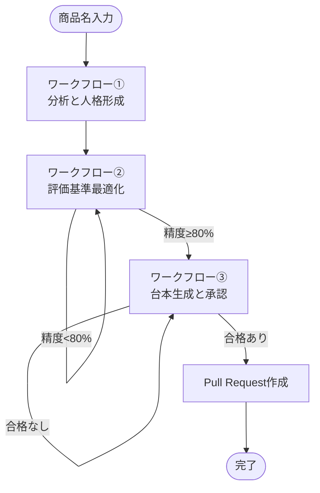
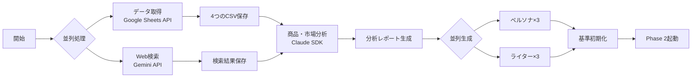
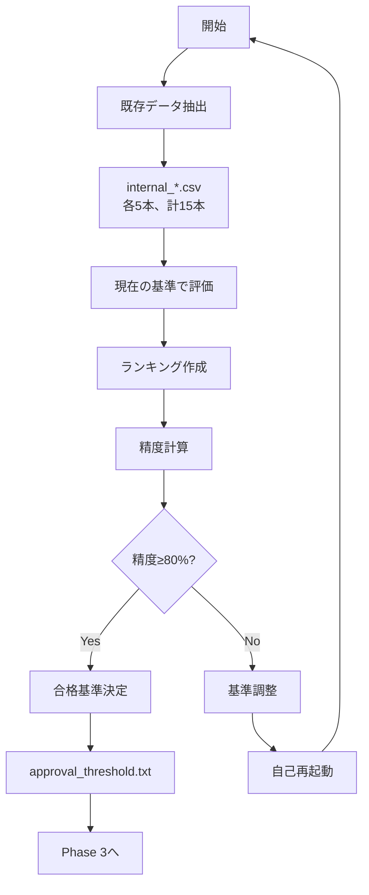
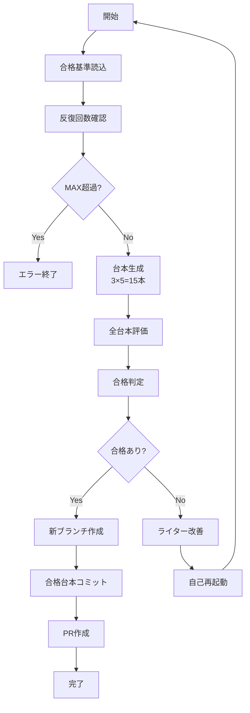

# AIクリエイティブ自動生成ワークフロー - 要件定義書準拠版 技術仕様書

## 1. システム概要

### 1.1 目的
市場分析からペルソナ構築、高品質な広告台本の生成・評価までの一連のプロセスを完全自動化するGitHub Actionsベースのワークフローシステム。**要件定義書に完全準拠**した実装。

### 1.2 基本原則
- **既存データからの学習**: Phase 2では既存の成功/失敗データから評価基準を学習
- **データ駆動型**: 実世界のデータに基づく客観的な評価
- **自己改善**: ループによる継続的な品質向上
- **6時間制限回避**: 3つの独立したワークフローで構成

### 1.3 主要技術スタック
- **AI処理**: Claude Code SDK (`@anthropic-ai/claude-code`)
- **Web検索**: Google Gemini API
- **データ取得**: Google Sheets API
- **ワークフロー**: GitHub Actions
- **データ処理**: Python 3.10 (pandas, numpy)
- **実行環境**: Ubuntu Latest

## 2. ワークフロー構成

### 2.1 全体アーキテクチャ



### 2.2 ワークフロー一覧

| 名称 | ファイル名 | 責務 |
|------|------------|------|
| ワークフロー① | `1-analysis-persona-generation-correct.yml` | 市場・商品を分析し、ペルソナとライターの人格を定義 |
| ワークフロー② | `2-criteria-optimization-correct.yml` | 既存データから評価基準を最適化し、合格基準スコアを決定 |
| ワークフロー③ | `3-script-generation-correct.yml` | 高品質な台本を生成し、合格したものをPRとして提出 |

## 3. Phase 1: 分析と人格形成

### 3.1 概要
**トリガー**: `workflow_dispatch` (手動実行)  
**入力**: `product_name` (商品名)

### 3.2 処理シーケンス



### 3.3 データ取得仕様

#### Google Sheetsから取得するデータ
```python
sheets = {
    'MarketBestsellers': 'market_bestsellers.csv',
    'InternalTop': 'internal_top_group.csv',
    'InternalMiddle': 'internal_middle_group.csv',
    'InternalBottom': 'internal_bottom_group.csv'
}
```

#### 必須カラム
- `script_id`: 台本ID
- `title`: タイトル
- `content`: 台本内容
- `performance_score`: パフォーマンススコア（任意）

### 3.4 生成物

#### ディレクトリ構造
```
{product_name}/
├── data/
│   ├── market_bestsellers.csv
│   ├── internal_top_group.csv
│   ├── internal_middle_group.csv
│   └── internal_bottom_group.csv
├── artifacts/
│   ├── web_search_summary.md
│   ├── product_analysis.md
│   ├── market_analysis.md
│   └── criteria.json
├── personas/
│   ├── persona1.md  # 実用性重視
│   ├── persona2.md  # 革新性重視
│   └── persona3.md  # 安定志向
└── writers/
    ├── writer1.md   # 感情訴求型
    ├── writer2.md   # 論理訴求型
    └── writer3.md   # ハイブリッド型
```

## 4. Phase 2: 評価基準最適化ループ（要件定義書準拠）

### 4.1 概要
**目的**: 既存の成功/失敗データから適切な評価基準を学習  
**トリガー**: Phase 1から自動起動  
**入力**: `product_name`

### 4.2 処理シーケンス



### 4.3 データ抽出戦略

```python
# 既存CSVから15本を抽出
scripts = []
scripts.extend(internal_top_group.csv[:5])      # 上位5本
scripts.extend(internal_middle_group.csv[:5])   # 中位5本
scripts.extend(internal_bottom_group.csv[:5])   # 下位5本
# 各台本にoriginal_groupラベルを付与
```

### 4.4 ランキング精度の計算

```python
def calculate_accuracy(rankings):
    correct = 0
    # 上位5本がtopグループか
    for i in range(5):
        if rankings[i]["original_group"] == "top":
            correct += 1
    # 中位5本がmiddleグループか
    for i in range(5, 10):
        if rankings[i]["original_group"] == "middle":
            correct += 1
    # 下位5本がbottomグループか
    for i in range(10, 15):
        if rankings[i]["original_group"] == "bottom":
            correct += 1
    
    accuracy = correct / 15
    return accuracy  # 目標: 0.8以上
```

### 4.5 合格基準の決定

```python
def determine_approval_threshold(rankings):
    # 精度80%達成時、5位のスコアを合格基準とする
    if calculate_accuracy(rankings) >= 0.8:
        threshold = rankings[4]["score"]  # 5位（0-indexed）
        with open("approval_threshold.txt", "w") as f:
            f.write(str(threshold))
        return threshold
    return None
```

### 4.6 評価基準の調整

精度が80%未満の場合、Claude SDKが以下を分析：
- どのグループの台本が誤った位置にあるか
- どの評価項目の重みが不適切か
- 重み付けをどう調整すべきか

## 5. Phase 3: 台本生成と承認ループ

### 5.1 概要
**トリガー**: Phase 2から自動起動  
**入力**: `product_name`  
**前提条件**: `approval_threshold.txt`が存在すること

### 5.2 処理シーケンス



### 5.3 台本生成仕様

```yaml
生成数: 15本
内訳:
  - writer1: 5本（感情訴求型）
  - writer2: 5本（論理訴求型）
  - writer3: 5本（ハイブリッド型）
保存先: {product_name}/scripts/iteration_{n}/
```

### 5.4 合格判定ロジック

```python
def evaluate_and_approve(script, threshold):
    score = calculate_score(script, criteria)
    passed = score >= threshold
    return {
        "script": script_name,
        "score": score,
        "passed": passed,
        "feedback": generate_feedback(script, score)
    }
```

### 5.5 PR作成条件

```yaml
条件: 合格台本が1本以上
ブランチ名: feature/approved-scripts-{product_name}-{timestamp}
内容:
  - 合格台本のみを含む
  - 評価スコアを記載
  - 自動生成されたことを明記
```

### 5.6 ライター改善（合格なしの場合）

Claude SDKが以下を実施：
1. 評価結果の分析
2. 共通の弱点の特定
3. ペルソナニーズとのギャップ分析
4. ライター人格の更新

## 6. 出力ファイル仕様

### 6.1 評価基準（criteria.json）
```json
{
  "version": 1,
  "weights": {
    "appeal_direction_clarity": 0.1,
    "differentiation_clarity": 0.1,
    "usp_strength": 0.1,
    "selection_reason_clarity": 0.1,
    "opening_hook_intensity": 0.1,
    "sales_pitch_elimination": 0.09,
    "character_edge": 0.09,
    "who_fmt_usp_integration": 0.09,
    "flow_naturalness": 0.09,
    "right_brain_impact": 0.09,
    "trust_building": 0.05
  },
  "criteria_names": {
    "appeal_direction_clarity": "訴求方向性の明確性・一貫性",
    "differentiation_clarity": "他選択肢との差別化の明確性",
    "usp_strength": "独自価値提案(USP)の強度",
    "selection_reason_clarity": "選ばれる理由の決定的明確性",
    "opening_hook_intensity": "冒頭フックの強烈さ",
    "sales_pitch_elimination": "売り込み感の排除度",
    "character_edge": "キャラクターのエッジ立ち",
    "who_fmt_usp_integration": "WHO-FMT-USP戦略的統合性",
    "flow_naturalness": "構成フローの自然さ",
    "right_brain_impact": "右脳直撃インパクト",
    "trust_building": "先回り対処による信頼構築"
  },
  "max_score": 10,
  "iteration": 0
}
```

**重要**: 評価項目（11項目）は固定。最適化時は重み付けのみを調整し、合計が1.0になるように正規化。

### 6.2 合格基準（approval_threshold.txt）
```
85.5  # 5位の台本のスコア
```

### 6.3 評価結果（evaluation_iteration_{n}.json）
```json
{
  "iteration": 1,
  "timestamp": "2024-12-10 10:30:00",
  "threshold": 85.5,
  "evaluations": [
    {
      "script": "writer1_script1",
      "score": 92.3,
      "passed": true,
      "scores_detail": {
        "appeal_direction_clarity": 9,
        "differentiation_clarity": 8,
        "usp_strength": 9,
        "selection_reason_clarity": 8,
        "opening_hook_intensity": 10,
        "sales_pitch_elimination": 7,
        "character_edge": 8,
        "who_fmt_usp_integration": 9,
        "flow_naturalness": 9,
        "right_brain_impact": 8,
        "trust_building": 7
      },
      "feedback": "強みと改善点"
    }
  ],
  "summary": {
    "total_scripts": 15,
    "passed_scripts": 3,
    "average_score": 78.5,
    "best_script": "writer1_script3",
    "best_score": 92.3
  }
}
```

## 7. Claude Code SDK設定

### 7.1 基本パラメータ
```bash
npx @anthropic-ai/claude-code \
  --allowedTools "Read,Write,Bash" \
  --max-turns 40 \
  --verbose \
  --permission-mode "acceptEdits" \
  -p "$PROMPT"
```

### 7.2 タスク別推奨設定

| Phase | タスク | allowedTools | max-turns | 理由 |
|-------|--------|--------------|-----------|------|
| 1 | データ取得 | Read,Write,Bash | 30 | API呼び出し |
| 1 | Web検索 | Read,Write,Bash | 40 | 複数検索 |
| 1 | 分析 | Read,Write | 40 | 複雑な分析 |
| 1 | ペルソナ生成 | Read,Write | 40 | 詳細な定義 |
| 2 | 評価 | Read,Write | 40 | 15本の評価 |
| 2 | 基準最適化 | Read,Write | 30 | 重み調整 |
| 3 | 台本生成 | Read,Write | 60 | 15本生成 |
| 3 | 評価 | Read,Write | 40 | スコアリング |

## 8. 環境変数とSecrets

### 8.1 必須のGitHub Secrets
```yaml
ANTHROPIC_API_KEY      # Claude API キー
GEMINI_API_KEY        # Google Gemini API キー  
GOOGLE_SHEETS_API_KEY # Google Sheets API キー
GOOGLE_SHEETS_ID      # 対象のGoogle Sheets ID
```

### 8.2 環境変数
```yaml
NODE_VERSION: '20'
PYTHON_VERSION: '3.10'
TARGET_ACCURACY: 0.8     # Phase 2の目標精度
MAX_ITERATIONS: 20       # Phase 3の最大反復回数
```

## 9. エラーハンドリング

### 9.1 Phase 2のエラー条件
- internal_*.csvファイルが存在しない
- CSVに必要なカラムがない
- 無限ループ防止（最大100回）

### 9.2 Phase 3のエラー条件
- approval_threshold.txtが存在しない
- 最大反復回数超過
- 台本生成失敗

## 10. パフォーマンス指標

### 10.1 実行時間の目安

| Phase | タスク | 推定時間 |
|-------|--------|----------|
| Phase 1 | データ取得 | 2-3分 |
| Phase 1 | Web検索 | 3-5分 |
| Phase 1 | 分析・生成 | 10-15分 |
| Phase 2 | 評価・最適化 | 5-10分×n回 |
| Phase 3 | 台本生成・評価 | 15-20分×n回 |

### 10.2 成功指標

| 指標 | 目標値 | 説明 |
|------|--------|------|
| Phase 2精度 | ≥80% | ランキング精度 |
| Phase 3合格率 | ≥20% | 15本中3本以上 |
| 総実行時間 | <2時間 | 全Phase完了まで |

## 11. トラブルシューティング

### 11.1 Phase 2が収束しない
**問題**: 精度が80%に達しない  
**原因**: 
- 初期重み付けが不適切
- データの質が悪い
- 評価項目が不足

**解決策**:
1. criteria.jsonの初期値を調整
2. CSVデータの品質確認
3. 評価項目の追加検討

### 11.2 Phase 3で合格台本が出ない
**問題**: approval_thresholdが高すぎる  
**原因**:
- Phase 2の5位スコアが異常に高い
- ライター人格が不適切

**解決策**:
1. Phase 2のデータを見直し
2. ライター人格を手動調整
3. 閾値を手動で下げる

## 12. ベストプラクティス

### 12.1 データ準備
- internal_*.csvは品質の差が明確なデータを用意
- 各グループ最低10本以上のデータを準備
- performance_scoreを正確に記録

### 12.2 ペルソナ設計
- 3つのペルソナは明確に差別化
- 評価視点を具体的に定義
- 実在の顧客セグメントに基づく

### 12.3 ライター設計
- 3つの異なるアプローチを明確化
- 各ライターの強みを活かす
- ペルソナとの相性を考慮

## 13. 拡張可能性

### 13.1 将来の改善案
- A/Bテスト機能の追加
- リアルタイム評価の実装
- 多言語対応
- 動画台本への拡張

### 13.2 統合可能なサービス
- Slack通知
- データベース連携
- CDN配信
- 分析ダッシュボード

## 14. バージョン履歴

| バージョン | 日付 | 変更内容 |
|-----------|------|----------|
| v1.0 | 2024-12-01 | 初期実装（誤った仕様） |
| v2.0 | 2024-12-10 | 要件定義書準拠版 |

## 15. 重要な注意事項

### 15.1 要件定義書との完全準拠
本実装は以下の点で要件定義書に完全準拠：
- Phase 2は**既存データから学習**（新規生成しない）
- ランキング精度80%で合格基準決定
- Phase 3は合格基準スコアでフィルタリング
- 合格台本のみをPRに含める

### 15.2 実装の特徴
- **データ駆動**: 実データに基づく客観的評価
- **自己改善**: ループによる継続的品質向上
- **完全自動化**: 人手介入なしで完結
- **6時間制限回避**: 独立ワークフローで構成

---

*このドキュメントは、要件定義書準拠版の完全な技術仕様書です。*
*最終更新: 2024年12月10日*