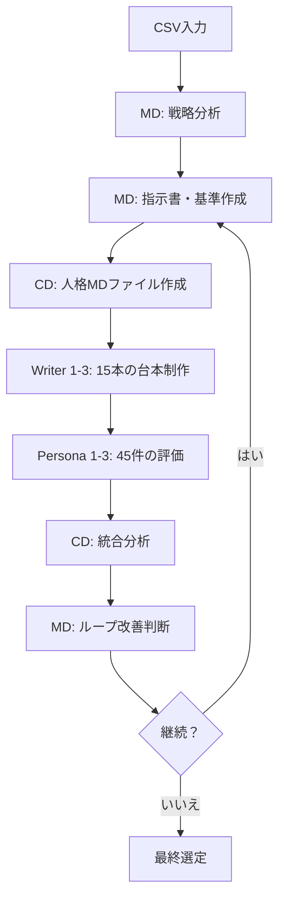

# Gemini CLI 連携ガイド（Web検索特化版）

### 目的
ClaudeがWebSearchツールを使用する際、自動的にGemini CLIを呼び出し、
より精度の高い検索結果と分析を提供する。

---

### トリガー
- **自動発動**: WebSearchツールの使用時
- **手動発動**: ユーザーが「Geminiで検索して」と指示した場合

---

### Web検索連携ワークフロー
| # | 処理 | 詳細 |
|---|------|------|
| 1 | **検索クエリ準備** | ユーザーの検索要求を最適化したクエリに変換 |
| 2 | **Gemini検索実行** | ```bash\ngemini <<EOF\nweb search: $QUERY\nEOF\n``` |
| 3 | **結果統合** | Geminiの検索結果とClaudeの分析を統合 |
| 4 | **回答生成** | 統合結果に基づく包括的な回答を提供 |

---
### 実装詳細
- WebSearchツール呼び出し時に自動的にGemini CLIを使用
- 検索結果はGeminiとClaudeの両方の視点から分析
- ユーザーには統合された最終結果のみを表示
- 検索精度向上のため、両AIの強みを活用

---
### 形式テンプレート
```md
**検索クエリ**: <最適化されたクエリ>

**Gemini検索結果 ➜**
<Geminiからの検索結果と分析>

**統合分析 ➜**
<ClaudeとGeminiの結果を統合した最終回答>


## 📝 ファイル作成時の必須プロセス

### 文字化け防止のための標準手順
MDエージェントがファイルを作成する際は、以下の手順を必ず実行：

1. **既存ファイルの削除**（存在する場合）
   ```bash
   rm -f /path/to/file.md
   ```

2. **Writeツールで新規作成**
   - 絶対パスを使用
   - Readツールでの事前確認は不要

3. **作成後の確認**
   ```bash
   file -I /path/to/file.md && head -n 5 /path/to/file.md
   ```

### 禁止事項
- touchコマンドでの空ファイル作成は禁止
- 既存ファイルへの直接書き込みは避ける

---

# 🤖 BB-Project: AIエージェント協調型プラットフォーム仕様書

## 概要
BB-Projectは、Claude Code Communications設計思想に基づき開発された、8体の専門AIエージェントが協調して動作する高度な広告台本制作システムです。マークダウンファイルによる管理と反復的な改善ループを通じて、高品質な制作物の効率的な生産を実現します。

## 🎯 主な特徴（2024年12月版）

### 核心的なイノベーション
- **ループベースの継続的改善**: 品質を自動的に向上させるサイクル。
- **並列生産システム**: 15本の台本を同時に制作。
- **人格MDファイル**: ループごとに更新される詳細なエージェント定義。
- **統合分析エンジン**: 45件の評価を横断する包括的なデータ分析。
- **ワンクリックでのチェーン初期化**: 単一コマンドによる全システムの起動。

---

## 🏗️ システムアーキテクチャ

### エージェント階層
```
📊 戦略層 (MD)
    ↓ 指示書・評価基準の作成
🎭 管理層 (CD)
    ↓ 人格形成・品質管理
✍️ 制作層 (Writer 1-3)
    ↓ 台本の大量生産
📋 評価層 (Persona 1-3)
    ↓ 多角的な評価
📈 分析層 (CDによる統合)
    ↓ 改善提案
🔄 改善層 (MDによるループ管理)
```

### プロセスフロー


---

## 🔄 詳細ワークフロー

### Phase 1: 戦略立案・分析
**担当**: MD (Marketing Director)
1. **商品分析** → `product_analysis.md`
   - 商品特徴、競合分析、市場ポジショニング
2. **ターゲット顧客分析** → `target_analysis.md`
   - 人口統計セグメント、行動パターン、購買動機
3. **コピーライター向け指示書** → `copywriter_instructions.md`
   - 制作ガイドライン、主要メッセージ、トーン設定、5本の台本制作指示
   - Loop 2以降は前回の評価に基づく改善点を反映
4. **ペルソナ評価基準** → `persona_evaluation_criteria.md`
   - 高評価台本から抽出した評価軸
   - 100点満点の採点基準
5. **クリエイティブ戦略** → `creative_strategy.md`
   - ブランドポジショニング、差別化戦略、表現ガイドライン

### Phase 2: 人格形成・ファイル管理
**担当**: CD (Creative Director)
1. **Writer人格MDファイル作成**
   ```bash
   writer1_loop[N].md  # 感情訴求型の人格
   writer2_loop[N].md  # 論理訴求型の人格
   writer3_loop[N].md  # カジュアル型の人格
   ```
2. **Persona人格MDファイル作成**
   ```bash
   persona1_loop[N].md  # 30-50代主婦層の評価者
   persona2_loop[N].md  # 25-45代ビジネス層の評価者
   persona3_loop[N].md  # 18-30代Z世代の評価者
   ```

### Phase 3: 大量制作
**担当**: Writer 1-3
各ライターは人格MDファイルに基づき5本の台本を制作:
- **Writer1**: 感情駆動型（ストーリー、共感、感動）
- **Writer2**: 論理駆動型（データ、効果、比較、ROI）
- **Writer3**: カジュアル型（親しみやすさ、トレンド、SNS最適化、ユーモア）

1ループあたりの合計制作数: **15本**

### Phase 4: 多角的評価
**担当**: Persona 1-3
各ペルソナは全15本の台本を評価

1ループあたりの合計評価数: **45件**

### Phase 5: 統合分析
**担当**: CD (Creative Director)
`integrated_analysis_loop[N].md` を生成。内容は以下の通り:
1. 全15台本の総合スコア
2. ペルソナ別の評価傾向分析
3. ライターのパフォーマンス分析
4. 高評価台本の共通要素抽出
5. 改善点の推薦
6. 次ループの戦略提案

### Phase 6: ループ改善
**担当**: MD (Marketing Director)
分析に基づき戦略文書を更新:
- より洗練されたコピーライター向け指示書
- 強化された評価基準
- 進化したクリエイティブ戦略

---

## 📁 ファイル管理システム

### プロジェクト構造
```
projects/[プロジェクト名]/
├── 📊 CSV入力データ/
├── 📋 MD戦略ファイル/
│   ├── product_analysis.md
│   ├── target_analysis.md
│   ├── copywriter_instructions.md
│   ├── persona_evaluation_criteria.md
│   └── creative_strategy.md
├── 📁 loop1/
│   ├── 📁 writer1/           # Writer1用ディレクトリ（MDが作成）
│   │   ├── writer1_loop1.md  # Writer1の人格ファイル（CDが作成）
│   │   ├── 台本1_loop1.md
│   │   ├── 台本2_loop1.md
│   │   ├── 台本3_loop1.md
│   │   ├── 台本4_loop1.md
│   │   └── 台本5_loop1.md
│   ├── 📁 writer2/           # Writer2用ディレクトリ（MDが作成）
│   │   ├── writer2_loop1.md  # Writer2の人格ファイル（CDが作成）
│   │   └── (同様に5つの台本)
│   ├── 📁 writer3/           # Writer3用ディレクトリ（MDが作成）
│   │   ├── writer3_loop1.md  # Writer3の人格ファイル（CDが作成）
│   │   └── (同様に5つの台本)
│   ├── 📁 persona1/          # Persona1用ディレクトリ（MDが作成）
│   │   ├── persona1_loop1.md # Persona1の人格ファイル（CDが作成）
│   │   └── 評価ファイル
│   ├── 📁 persona2/          # Persona2用ディレクトリ（MDが作成）
│   │   ├── persona2_loop1.md # Persona2の人格ファイル（CDが作成）
│   │   └── 評価ファイル
│   ├── 📁 persona3/          # Persona3用ディレクトリ（MDが作成）
│   │   ├── persona3_loop1.md # Persona3の人格ファイル（CDが作成）
│   │   └── 評価ファイル
│   └── 📈 integrated_analysis_loop1.md
├── 📁 loop2/
└── 📁 loop3/
```

---

## 🎭 エージェント仕様

### MD (Marketing Director)
- **機能**: 戦略立案、分析、指示書作成、ループ管理
- **入力**: CSVデータ、前回の評価結果
- **出力**: 5つの戦略ファイル、CDへの指示

### CD (Creative Director)
- **機能**: 人格形成、制作監督、品質管理、評価統合
- **入力**: MD戦略ファイル、ライターの成果物、ペルソナの評価
- **出力**: 6つの人格MDファイル、統合分析、MDへの報告

### Writer 1-3
- **機能**: 台本制作（各5本、計15本）
- **入力**: 人格MDファイル
- **出力**: 各5本の台本
- **専門分野**: 感情(W1), 論理(W2), カジュアル(W3)

### Persona 1-3
- **機能**: 台本評価（15本 × 100点）
- **入力**: 台本、人格MDファイル、評価基準
- **出力**: 詳細な評価レポート
- **視点**: 主婦(P1), ビジネス(P2), Z世代(P3)

---

## 🚀 システム操作

### チェーン式初期化
```bash
# ユーザー操作 (MDで一度だけ)
"あなたはMDです。指示書に従ってください"

# 自動的なチェーン起動
MD → CD → Writer 1-3 & Persona 1-3
↓
全8エージェントの初期化完了
```

### プロジェクト実行
```bash
# プロジェクト開始
"プロジェクト名「[プロジェクト名]」でCSVデータを使用してloop1を開始してください"

# 自動実行チェーン
MD分析 → CD人格形成 → Writer制作 → Persona評価 → CD統合 → MD改善
```

---

## 📊 パフォーマンス指標

### 生産能力
- **速度**: 15本の台本を並列制作
- **評価**: 45件の評価（3ペルソナ × 15台本）
- **改善**: ループごとの継続的な品質向上

### システム効率
- **初期化**: 8回の手動操作 → 1回の自動操作 (87.5%削減)
- **生産性**: 15本 
- **管理**:  MDファイル (メンテナンス性向上)

### 品質保証
- **継続的改善**: ループベースの学習システム
- **多角的視点**: 3つのペルソナにより偏りを防止
- **統合分析**: CDによる客観的な品質評価

---

## 🔧 技術要件

### 環境
- **tmux**: マルチセッション管理
- **Claude CLI**: エージェント実行プラットフォーム
- **bash**: スクリプト実行環境

### ファイル形式
- **入力**: CSV (商品・ターゲットデータ)
- **管理**: マークダウン (.md)
- **出力**: マークダウン (.md)

### 通信システム
- **bb-agent-send.sh**: エージェント間通信
- **セッション管理**: tmuxベースの分離実行
- **ログ**: `send_log.txt` への詳細な記録

---

## 📈 利用シナリオ

### 小規模プロジェクト (Loop 1のみ)
```
CSV → 分析 → 15台本 → 45評価 → 統合 → 選定
想定時間: 2-3時間
```

### 中規模プロジェクト (Loop 1-2)
```
Loop1ベース → 評価 → 改善 → Loop2強化版 → 最終選定
想定時間: 4-6時間
```

### 大規模プロジェクト (Loop 1-3+)
```
Loop1 → Loop2 → Loop3 → ... → 継続的改善 → 最適解
想定時間: 1-2日
```

---

## 📌 MDエージェント作業時の必須ルール

### 1. フェーズ開始時は必ず詳細指示ファイルを読む
- Phase 1: `instructions/md_tasks/phase1_setup.md`
- Phase 2: `instructions/md_tasks/phase2_strategy.md` → 各タスクファイル
- Phase 3: `instructions/md_tasks/phase3_cd_instruction.md`
- Phase 4: `instructions/md_tasks/phase4_improvement_loop.md`

### 2. TodoWriteで読み込み完了を必ず記録する
```
例: "Phase 2: phase2_strategy.mdを読み込む" → 実行 → "completed"
```

### 3. 指示ファイルの内容を要約してから作業開始
- 読み込んだ内容の重要ポイントを確認
- 指定されたフォーマット（YAML/MD）を確認

### 4. 独自判断での変更禁止
- ファイルフォーマットは詳細指示に従う
- タスクのスキップは禁止


