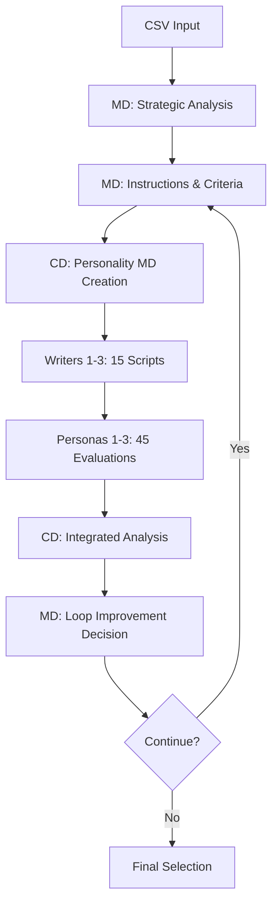

# 🤖 BB-Project: Multi-Agent Communications Platform

## Overview
BB-Project is an advanced AI agent orchestration system built on Claude Code Communications principles. It features 8 specialized AI agents working collaboratively to produce high-quality advertising scripts through markdown-based management and iterative improvement loops.

## 🎯 Key Features (December 2024)

### Core Innovations
- **Loop-Based Continuous Improvement**: Automated quality enhancement cycles
- **Parallel Production System**: 15 scripts produced simultaneously
- **Personality MD Files**: Detailed agent definitions updated per loop
- **Integrated Analysis Engine**: Comprehensive data analysis across 45 evaluations
- **One-Click Chain Initialization**: Complete system startup with single command

## 🏗️ System Architecture

### Agent Hierarchy
```
📊 Strategic Layer (MD)
    ↓ Instructions & Evaluation Criteria
🎭 Management Layer (CD)
    ↓ Personality Formation & Quality Control
✍️ Production Layer (Writers 1-3)
    ↓ Mass Script Production
📋 Evaluation Layer (Personas 1-3)
    ↓ Multi-perspective Assessment
📈 Analysis Layer (CD Integration)
    ↓ Improvement Proposals
🔄 Improvement Layer (MD Loop Management)
```

### Process Flow


## 🔄 Detailed Workflow

### Phase 1: Strategic Planning & Analysis
**Owner**: MD (Marketing Director)

1. **Product Analysis** → `product_analysis.md`
   - Product features, competitive analysis, market positioning

2. **Target Audience Analysis** → `target_analysis.md`
   - Demographic segmentation, behavioral patterns, purchase motivations

3. **Copywriter Instructions** → `copywriter_instructions.md`
   - Production guidelines, key messages, tone settings, 5-script directive
   - Loop 2+ includes improvements based on previous evaluations

4. **Persona Evaluation Criteria** → `persona_evaluation_criteria.md`
   - Evaluation axes derived from top-performing scripts
   - 100-point scoring breakdown

5. **Creative Strategy** → `creative_strategy.md`
   - Brand positioning, differentiation strategy, expression guidelines

### Phase 2: Personality Formation & File Management
**Owner**: CD (Creative Director)

1. **Writer Personality MD Files**
   ```bash
   writer1_loop[N].md  # Emotion-focused personality
   writer2_loop[N].md  # Logic-focused personality
   writer3_loop[N].md  # Casual-focused personality
   ```

2. **Persona Personality MD Files**
   ```bash
   persona1_loop[N].md  # 30-50s housewife evaluator
   persona2_loop[N].md  # 25-45s business evaluator
   persona3_loop[N].md  # 18-30s Gen Z evaluator
   ```

### Phase 3: Mass Production
**Owner**: Writers 1-3

Each writer produces 5 scripts based on their personality MD file:
- **Writer1**: Emotion-driven scripts (storytelling, empathy, inspiration)
- **Writer2**: Logic-driven scripts (data, efficacy, comparison, ROI)
- **Writer3**: Casual scripts (friendly, trendy, SNS-optimized, humor)

Total output: 15 scripts per loop

### Phase 4: Multi-Perspective Evaluation
**Owner**: Personas 1-3

Each persona evaluates all 15 scripts (100 points each):
- **Persona1**: Empathy (40), Familiarity (30), Purchase Intent (30)
- **Persona2**: Logic (40), Efficiency (30), Credibility (30)
- **Persona3**: Trendiness (40), SNS Appeal (30), Virality (30)

Total evaluations: 45 per loop

### Phase 5: Integrated Analysis
**Owner**: CD (Creative Director)

Produces `integrated_analysis_loop[N].md` containing:
1. Overall scores for all 15 scripts
2. Persona-specific evaluation trends
3. Writer performance analysis
4. Common elements in high-scoring scripts
5. Improvement recommendations
6. Next loop strategy proposals

### Phase 6: Loop Improvement
**Owner**: MD (Marketing Director)

Updates strategic documents based on analysis:
- Refined copywriter instructions
- Enhanced evaluation criteria
- Evolved creative strategy

## 📁 File Management System

### Project Structure
```
projects/[PROJECT_NAME]/
├── 📊 CSV Input Data
├── 📋 MD Strategic Files
│   ├── product_analysis.md
│   ├── target_analysis.md
│   ├── copywriter_instructions.md
│   ├── persona_evaluation_criteria.md
│   └── creative_strategy.md
├── 📁 loop1/
│   ├── 👥 Personality Files
│   │   ├── writer[1-3]_loop1.md
│   │   └── persona[1-3]_loop1.md
│   ├── 📝 Scripts (15 total)
│   ├── 📊 Evaluations
│   └── 📈 integrated_analysis_loop1.md
├── 📁 loop2/
└── 📁 loop3/
```

## 🎭 Agent Specifications

### MD (Marketing Director)
- **Functions**: Strategic planning, analysis, instruction creation, loop management
- **Inputs**: CSV data, previous evaluation results
- **Outputs**: 5 strategic files, CD instructions

### CD (Creative Director)
- **Functions**: Personality formation, production oversight, quality control, evaluation integration
- **Inputs**: MD strategic files, Writer outputs, Persona evaluations
- **Outputs**: 6 personality MD files, integrated analysis, MD reports

### Writers 1-3
- **Functions**: Script production (5 each, total 15)
- **Inputs**: Personality MD files
- **Outputs**: 5 scripts each
- **Specialization**: Emotion (W1), Logic (W2), Casual (W3)

### Personas 1-3
- **Functions**: Script evaluation (15 scripts × 100 points)
- **Inputs**: Scripts, personality MD files, evaluation criteria
- **Outputs**: Detailed evaluation reports
- **Perspectives**: Housewife (P1), Business (P2), Gen Z (P3)

## 🚀 System Operation

### Chain Initialization
```bash
# User operation (MD only, once)
"You are MD. Follow the instructions"

# Automatic chain activation
MD → CD → Writers 1-3 → Personas 1-3
↓
All 8 agents initialized
```

### Project Execution
```bash
# Project start
"Start project '[PROJECT_NAME]' with CSV data for loop1"

# Automatic execution chain
MD Analysis → CD Formation → Writer Production → Persona Evaluation → CD Integration → MD Improvement
```

## 📊 Performance Metrics

### Production Capacity
- **Speed**: 15 scripts in parallel
- **Evaluation**: 45 assessments (3 personas × 15 scripts)
- **Improvement**: Continuous quality enhancement per loop

### System Efficiency
- **Initialization**: 8 manual → 1 automatic (87.5% reduction)
- **Production**: 9 → 15 scripts (66.7% increase)
- **Management**: Python → MD files (improved maintainability)

### Quality Assurance
- **Continuous Improvement**: Loop-based learning system
- **Multi-perspective**: 3 personas prevent bias
- **Integrated Analysis**: Objective quality assessment by CD

## 🔧 Technical Requirements

### Environment
- **tmux**: Multi-session management
- **Claude CLI**: Agent execution platform
- **bash**: Script execution environment

### File Formats
- **Input**: CSV (product/target data)
- **Management**: Markdown (.md)
- **Output**: Markdown (.md)

### Communication System
- **bb-agent-send.sh**: Inter-agent communication
- **Session Management**: tmux-based isolated execution
- **Logging**: Detailed send_log.txt records

## 📈 Usage Scenarios

### Small Projects (Loop 1 Only)
```
CSV → Analysis → 15 Scripts → 45 Evaluations → Integration → Selection
Estimated time: 2-3 hours
```

### Medium Projects (Loops 1-2)
```
Loop1 Base → Evaluation → Improvement → Loop2 Enhanced → Final Selection
Estimated time: 4-6 hours
```

### Large Projects (Loops 1-3+)
```
Loop1 → Loop2 → Loop3 → ... → Continuous Improvement → Optimal Solution
Estimated time: 1-2 days
```

## 🎯 Success Factors

### System Design
- **Modularity**: Independent agent architecture
- **Automation**: Chain execution efficiency
- **Visibility**: MD file transparency
- **Learning**: Loop-based continuous improvement

### Operational Features
- **Scalability**: Flexible response to project scale
- **Reproducibility**: File-based result tracking
- **Customizability**: Industry-specific personality adjustments
- **Maintainability**: Simple structure for long-term operation

## 🔐 Security & Best Practices

### Data Protection
- Never commit sensitive CSV data
- Use .gitignore for personal/client data
- Sanitize outputs before sharing

### Code Quality
- Follow existing codebase conventions
- No hardcoded credentials
- Comprehensive error handling
- Clear documentation in MD files

### Version Control
- Meaningful commit messages
- Track loop iterations separately
- Archive successful configurations
- Document improvement rationale

---

**BB-Project** represents the next generation of AI collaborative platforms, implementing Claude Code Communications philosophy through markdown-based management and loop improvement systems. This architecture breaks through traditional constraints to deliver innovative script creation experiences at scale.