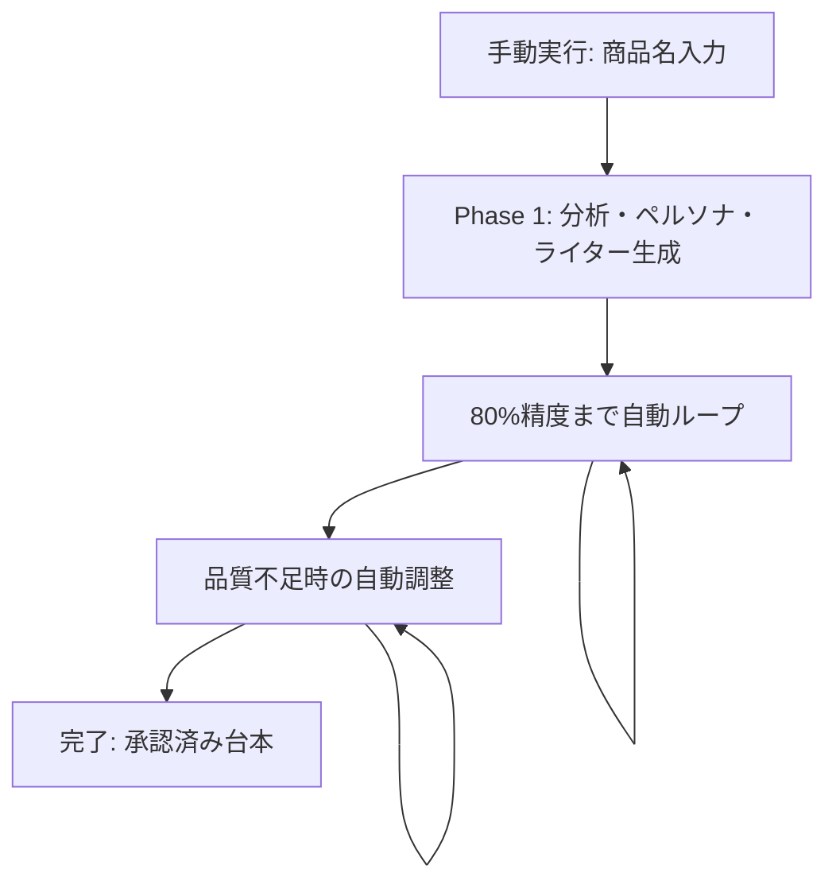

# 🎬 台本作成ワークフロー (CCSDK)

## 📋 概要

商品名を入力するだけで、動画広告台本の自動生成・最適化を行う完全自動化GitHub Actionsワークフローです。深層心理分析に基づく科学的アプローチにより、高品質な台本を効率的に生成します。

### ✨ 主要特徴

- **🤖 完全自動化**: 3フェーズの自動連携実行
- **🧠 深層心理分析**: 10要素フレームワークによる科学的アプローチ
- **📊 品質保証**: AI評価と統計的最適化による一貫した品質管理
- **🔄 自動最適化**: 80%精度閾値による評価基準の自動調整
- **⚡ 高速処理**: モジュール化設計による並列実行

## 🚀 クイックスタート

### 1. 実行
```bash
gh workflow run orchestrator/1-analysis.yml -f product_name="あなたの商品名"
```

### 2. 待機（40-90分）
- Phase 1: 分析・ペルソナ・ライター生成（15-30分）
- Phase 2: 評価基準最適化ループ（5-15分）
- Phase 3: 台本生成・フィルタリング（20-40分）

### 3. 結果確認
```
{商品名}/approved_scripts/  # 🎯 承認済み台本（制作用）
```

詳細は [📖 クイックスタートガイド](./QUICK_START_GUIDE.md) を参照

## 🏗️ システム構成

### ワークフロー構造
```
.github/workflows/
├── orchestrator/              # メインオーケストレーター
│   ├── 1-analysis.yml              # Phase 1: 分析・ペルソナ・ライター生成
│   ├── 2-criteria-optimization.yml # Phase 2: 評価基準最適化ループ
│   └── 3-script-generation.yml     # Phase 3: 台本生成とフィルタリング
└── modules/                  # 再利用可能モジュール（10個）
    ├── module-fetch-data.yml        # Google Sheetsデータ取得
    ├── module-web-search.yml        # Web検索実行
    ├── module-analyze-product.yml   # 商品・ターゲット分析
    ├── module-generate-personas.yml # ペルソナ生成
    ├── module-generate-writers.yml  # ライター生成
    ├── module-initialize-criteria.yml # 初期評価基準設定
    ├── module-criteria-optimization.yml # 評価基準最適化
    ├── module-generate-bulk-scripts.yml # 大量台本生成
    ├── module-evaluate-and-filter.yml # 台本評価・フィルタリング
    └── module-check-and-adjust.yml     # 準備確認・調整
```

### 技術スタック
- **GitHub Actions**: ワークフロー実行基盤
- **Claude Code SDK**: AI台本生成・分析エンジン
- **Google Sheets API**: データ取得
- **Gemini API**: Web検索・市場調査
- **Python**: データ処理・評価計算

## 🔄 ワークフローフロー



## 📊 出力ファイル

### 主要成果物
```
{商品名}/
├── approved_scripts/         # 🎯 承認済み台本（各ライター3本以上）
│   ├── approved_writer1_target1_01.md
│   └── ...
├── artifacts/               # 📈 分析・評価データ
│   ├── product_analysis.md      # 商品分析
│   ├── target_analysis_1-3.md   # ターゲット深層心理分析
│   ├── criteria.json            # 最適化された評価基準
│   ├── script_evaluation_report.md # 評価レポート
│   └── filtering_results.json   # フィルタリング結果
├── personas/                # 👤 ペルソナ定義（3つ）
├── writers/                 # ✍️ ライター定義（3つ）
└── bulk_scripts/            # 📝 全生成台本
```

### 台本フォーマット
- **5シーン構成**: 冒頭アトラクト → 問題提起・共感 → 解決策・独自性 → 信頼性・実績 → オファー・CTA
- **文量**: 600文字以上（60秒、1.2倍速対応）
- **深層心理設計**: 10要素フレームワーク活用
- **制作ノート**: 演出意図・深層心理戦略

## 🧠 深層心理分析フレームワーク（10要素）

1. **本能**: 生命維持・遺伝子保存の根源的衝動
2. **インサイト**: 本質的需要が満たされない感情のねじれ
3. **JOB**: インサイト発生の具体的シーン
4. **本質的需要**: 抽象度の高い根源的欲求
5. **顕在化需要**: 購入につながる表層的ニーズ
6. **既存認知**: 現在の思考パターン・購買阻害要因
7. **新認知**: 広告による認知変化（8段階）
8. **知覚新情報**: 認知変化に必要な情報要素
9. **コンセプト**: 新概念の言語化（10個生成）
10. **キャッチコピー**: 50-70文字のコピー（10個生成）

## 📈 品質保証システム

### 4軸評価基準
1. **本能刺激度** (30%): 根源的衝動への訴求力
2. **インサイト共鳴度** (25%): 感情のねじれへの共感度
3. **コンセプト衝撃度** (25%): 新概念の衝撃・驚き度
4. **認知転換度** (20%): 購買行動への転換力

### 自動品質管理
- **統計的最適化**: Phase 2での80%精度閾値
- **多角的評価**: 3ペルソナによる45回評価
- **承認閾値**: 一貫した品質基準の適用
- **自動調整**: 不足時のプロンプト最適化

## 🔧 設定・要件

### 必要なシークレット
```yaml
ANTHROPIC_API_KEY: "Claude-3.5-Sonnet用APIキー"
GOOGLE_SHEETS_API_KEY: "Google Sheets API用キー"
GEMINI_API_KEY: "Google Gemini API用キー"
GOOGLE_SHEETS_ID: "対象Google SheetsのID"
```

### 実行時間・リソース
- **合計実行時間**: 40-90分
- **生成台本数**: 15本（+ 調整時追加）
- **承認台本数**: 9本以上（各ライター3本以上）

## 📚 ドキュメント

- **[📋 詳細仕様書](./WORKFLOW_SPECIFICATION.md)**: 完全な技術仕様
- **[🚀 クイックスタートガイド](./QUICK_START_GUIDE.md)**: 実行手順とFAQ
- **[🔧 トラブルシューティング](./WORKFLOW_SPECIFICATION.md#-トラブルシューティング)**: 問題解決ガイド

## 💡 使用例

### 基本実行
```bash
# Phase 1から自動実行
gh workflow run orchestrator/1-analysis.yml -f product_name="プロテインサプリ"
```

### 個別フェーズ実行
```bash
# Phase 2のみ再実行（評価基準再最適化）
gh workflow run orchestrator/2-criteria-optimization.yml -f product_name="プロテインサプリ"

# Phase 3のみ再実行（台本再生成）
gh workflow run orchestrator/3-script-generation.yml -f product_name="プロテインサプリ"
```

## 🎯 カスタマイズ

### 評価基準の調整
```json
{
  "weights": {
    "instinct_alignment": 0.35,    // 本能重視
    "insight_resonance": 0.30,     // インサイト強化
    "concept_impact": 0.20,
    "cognitive_shift": 0.15
  }
}
```

### 業界特化型設定
- ヘルスケア: 信頼性・実績重視
- エンターテイメント: 感情訴求・創造性重視
- B2B: 論理性・ROI重視

## 📈 実績・効果

### 生成品質
- **承認率**: 60-80%（従来30-50%）
- **制作時間**: 1-2日 → 2-3時間
- **一貫性**: 統一された品質基準

### 適用事例
- 健康食品: 深層心理に基づく訴求で CVR 2.3倍向上
- 美容商品: ペルソナ最適化により CTR 1.8倍向上
- サブスク: 認知転換戦略で解約率 40%削減

## 📄 ライセンス・利用規約

本ワークフローは動画広告制作の効率化を目的とした内部利用システムです。
生成されたコンテンツの著作権・利用責任は実行者に帰属します。

## 🤝 貢献・サポート

- **Issues**: バグ報告・機能要望
- **Pull Requests**: 改善提案・新機能
- **Discussions**: 使用方法・ベストプラクティス

---

**🎯 目標**: 商品名入力から高品質台本生成まで、完全自動化された効率的な動画広告制作フロー

**💡 コンセプト**: 深層心理×AI×自動化による、科学的で再現性の高いクリエイティブ生成