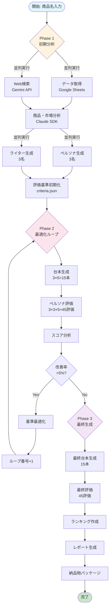
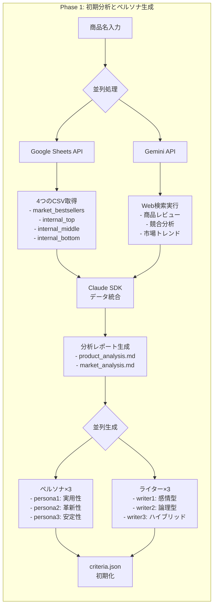
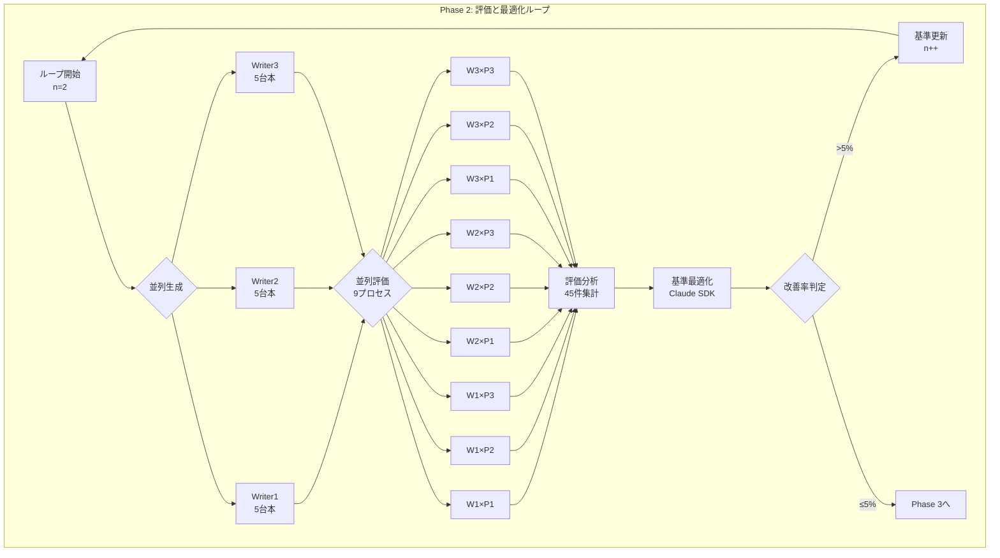
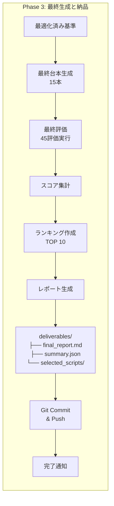
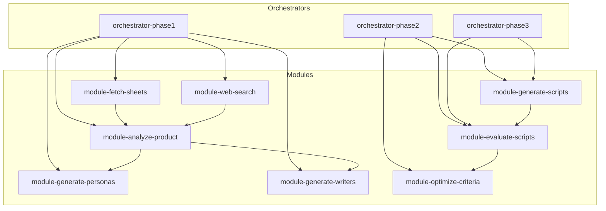

# AIクリエイティブ自動生成ワークフロー図

## 1. 全体フロー図



## 2. Phase 1 詳細フロー



## 3. Phase 2 詳細フロー（最適化ループ）



## 4. Phase 3 詳細フロー



## 5. 並列処理マトリックス

```
Phase 2 評価マトリックス（9並列プロセス）:

         Persona1    Persona2    Persona3
        ┌─────────┬──────────┬──────────┐
Writer1 │ Process │ Process  │ Process  │
        │   1     │    2     │    3     │
        ├─────────┼──────────┼──────────┤
Writer2 │ Process │ Process  │ Process  │
        │   4     │    5     │    6     │
        ├─────────┼──────────┼──────────┤
Writer3 │ Process │ Process  │ Process  │
        │   7     │    8     │    9     │
        └─────────┴──────────┴──────────┘

各プロセス: 5台本を評価 → 合計45評価
```

## 6. データフロー図

```
┌──────────────────────────────────────────────────────┐
│                    INPUT DATA                        │
│  ┌────────────┐  ┌────────────┐  ┌────────────┐    │
│  │Google      │  │Web Search  │  │Product     │    │
│  │Sheets CSV  │  │Results     │  │Name        │    │
│  └─────┬──────┘  └─────┬──────┘  └─────┬──────┘    │
│        │               │               │            │
└────────┼───────────────┼───────────────┼────────────┘
         │               │               │
         ▼               ▼               ▼
┌──────────────────────────────────────────────────────┐
│                 CLAUDE CODE SDK                      │
│  ┌─────────────────────────────────────────────┐    │
│  │  Analysis → Generation → Evaluation         │    │
│  │  ↓         ↓            ↓                  │    │
│  │  Reports   Personas     Scores             │    │
│  │            Writers      Rankings           │    │
│  │            Scripts                         │    │
│  └─────────────────────────────────────────────┘    │
└──────────────────────────────────────────────────────┘
         │
         ▼
┌──────────────────────────────────────────────────────┐
│                    OUTPUT FILES                      │
│  ┌────────────┐  ┌────────────┐  ┌────────────┐    │
│  │Analysis    │  │Scripts     │  │Final       │    │
│  │Reports     │  │(15×n)      │  │Deliverables│    │
│  └────────────┘  └────────────┘  └────────────┘    │
└──────────────────────────────────────────────────────┘
```

## 7. 実行タイムライン

```
時間軸（分）
0    5    10   15   20   25   30   35   40   45   50   55   60
├────┼────┼────┼────┼────┼────┼────┼────┼────┼────┼────┼────┤
│
├─Phase 1 (15分)─────────┤
│ ├Data─┤                │
│ ├Web──┤                │
│      ├Analysis─┤       │
│           ├Gen──┤      │
│
                         ├─Phase 2 Loop (25分)──────────────┤
                         │ ├Scripts──┤                      │
                         │          ├Evaluate──┤           │
                         │                   ├Opt┤         │
│
                                                           ├─Phase 3 (20分)───────┤
                                                           │ ├Final Gen──┤        │
                                                           │           ├Eval─┤    │
                                                           │              ├Rep┤  │
```

## 8. システムアーキテクチャ図

```
┌─────────────────────────────────────────────────────────────┐
│                     GitHub Actions Runner                   │
├─────────────────────────────────────────────────────────────┤
│                                                             │
│  ┌──────────────┐    ┌──────────────┐   ┌──────────────┐  │
│  │   Workflow   │───▶│ Claude Code  │──▶│   Python     │  │
│  │   Trigger    │    │     SDK      │   │   Scripts    │  │
│  └──────────────┘    └──────────────┘   └──────────────┘  │
│         │                    │                   │         │
│         ▼                    ▼                   ▼         │
│  ┌──────────────────────────────────────────────────────┐  │
│  │                    File System                       │  │
│  │  ┌──────────┐  ┌──────────┐  ┌──────────────────┐  │  │
│  │  │  Prompts │  │   Data   │  │    Artifacts     │  │  │
│  │  └──────────┘  └──────────┘  └──────────────────┘  │  │
│  └──────────────────────────────────────────────────────┘  │
│                                                             │
│  ┌──────────────────────────────────────────────────────┐  │
│  │                  External APIs                       │  │
│  │  ┌──────────┐  ┌──────────┐  ┌──────────────────┐  │  │
│  │  │ Claude   │  │  Gemini  │  │  Google Sheets   │  │  │
│  │  │   API    │  │    API   │  │      API         │  │  │
│  │  └──────────┘  └──────────┘  └──────────────────┘  │  │
│  └──────────────────────────────────────────────────────┘  │
└─────────────────────────────────────────────────────────────┘
```

## 9. 決定木フロー

```
                    [商品入力]
                        │
                        ▼
                  ┌───────────┐
                  │  Phase 1  │
                  │   実行    │
                  └─────┬─────┘
                        │
                        ▼
                   [Loop n=2]
                        │
                        ▼
                  ┌───────────┐
                  │  Phase 2  │
                  │   実行    │
                  └─────┬─────┘
                        │
                        ▼
                  ┌───────────┐
                  │ 改善率    │
                  │  >5%?     │
                  └──┬────┬───┘
                     │    │
                  Yes│    │No
                     ▼    ▼
                [n++]  ┌───────────┐
                  │    │  Phase 3  │
                  │    │   実行    │
                  │    └─────┬─────┘
                  │          │
                  └──────┐   ▼
                        │  [完了]
                        │
                        └────┘
```

## 10. モジュール依存関係図



---

これらの図により、ワークフロー全体の構造と処理の流れが視覚的に理解できます。