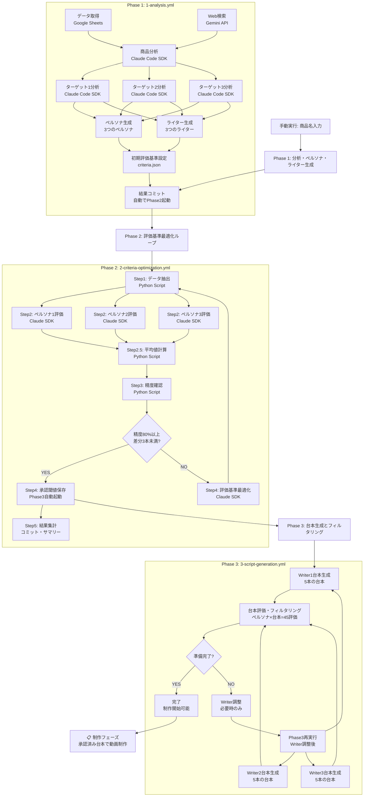

# 台本作成ワークフロー (CCSDK) - 仕様書

## 📋 概要

本ワークフローは、動画広告台本の自動生成・最適化を行うGitHub Actionsベースのシステムです。商品名を入力するだけで、市場調査から高品質台本生成まで、完全自動化された制作フローを提供します。

### システム特徴
- **完全自動化**: 3フェーズの自動連携実行
- **深層心理分析**: 10要素フレームワークによる科学的アプローチ
- **品質保証**: AI評価と統計的最適化による一貫した品質管理
- **スケーラビリティ**: モジュール化設計による高い再利用性

---

## 🏗️ システム構成

### ファイル構造
```
.github/workflows/
├── orchestrator/           # メインオーケストレーター
│   ├── 1-analysis.yml           # Phase 1: 分析・ペルソナ・ライター生成
│   ├── 2-criteria-optimization.yml # Phase 2: 評価基準最適化ループ
│   └── 3-script-generation.yml     # Phase 3: 台本生成とフィルタリング
├── modules/               # 再利用可能モジュール（15個）
│   ├── module-fetch-data.yml        # Google Sheetsデータ取得
│   ├── module-web-search.yml        # Web検索実行
│   ├── module-product-analysis.yml  # 商品分析
│   ├── module-target1-analysis.yml  # ターゲット1分析（並列実行）
│   ├── module-target2-analysis.yml  # ターゲット2分析（並列実行）
│   ├── module-target3-analysis.yml  # ターゲット3分析（並列実行）
│   ├── module-generate-personas.yml # ペルソナ生成
│   ├── module-generate-writers.yml  # ライター生成
│   ├── module-initialize-criteria.yml # 初期評価基準設定
│   ├── module-persona1-evaluation.yml # ペルソナ1評価（並列実行）
│   ├── module-persona2-evaluation.yml # ペルソナ2評価（並列実行）
│   ├── module-persona3-evaluation.yml # ペルソナ3評価（並列実行）
│   ├── module-generate-scripts-writer1.yml # Writer1台本生成（並列実行）
│   ├── module-generate-scripts-writer2.yml # Writer2台本生成（並列実行）
│   ├── module-generate-scripts-writer3.yml # Writer3台本生成（並列実行）
│   └── module-evaluate-and-filter.yml # 台本評価・フィルタリング・Phase4準備判定
└── scripts/python/       # Pythonスクリプト（6個 + README）
    ├── extract_sample_scripts.py    # Phase 2: データ抽出
    ├── calculate_persona_averages.py # Phase 2: 平均値計算・ランキング
    ├── check_evaluation_precision.py # Phase 2: 精度確認
    ├── execute_next_action.py       # Phase 2: アクション実行
    ├── calculate_script_averages.py # Phase 3: 台本評価平均値計算
    ├── filter_approved_scripts.py  # Phase 3: 承認台本フィルタリング
    └── README.md                   # スクリプト説明書
    
注: Phase 1はGitHub Actionsモジュール（.yml）で直接実装
    Phase 2・3は一部Pythonスクリプトを併用
```

### 技術スタック
- **GitHub Actions**: ワークフロー実行基盤
- **Claude Code SDK**: AI台本生成・分析エンジン
- **Google Sheets API**: データ取得
- **Gemini API**: Web検索・市場調査
- **Python 3.10**: データ処理・評価計算・精度確認
- **Node.js 20**: Claude Code SDK実行環境

### アーキテクチャ設計
- **オーケストレーター**: 各フェーズの全体フローを管理
- **モジュール**: 特定のタスクを実行する再利用可能コンポーネント
- **Pythonスクリプト**: 複雑なデータ処理・計算ロジックを担当
- **ハイブリッド実行**: GitHub ActionsとPythonスクリプトの最適な組み合わせ

---

## 🔄 ワークフロー実行フロー



---

## 🚀 Phase 1: 分析・ペルソナ・ライター生成フェーズ

### 実行方法
```bash
gh workflow run orchestrator/1-analysis.yml -f product_name="商品名"
```

### 入力パラメータ
- `product_name` (必須): 商品名
- `sheets_id` (オプション): Google Sheets ID（デフォルト: シークレット値使用）

### 実行ステップ

#### Step 1-2: 並列データ収集
**`module-fetch-data`**: Google Sheetsからデータ取得
- 取得ファイル:
  - `market_bestsellers.csv` - 市場ベストセラーデータ
  - `internal_top_group.csv` - 社内上位グループ
  - `internal_middle_group.csv` - 社内中位グループ
  - `internal_bottom_group.csv` - 社内下位グループ
- 実行時間: 最大30ターン
- 保存先: `{商品名}/data/`

**`module-web-search`**: Gemini APIによるWeb検索
- 市場調査・競合分析の実施
- 保存先: `{商品名}/artifacts/web_search_summary.md`

#### Step 3: 商品・ターゲット分析（並列実行）

**3-1. 商品分析**
- **実行**: `module-product-analysis.yml`
- **出力**: `{商品名}/artifacts/product_analysis.md`
- **内容**: 商品特徴、市場ポジション、USP分析

**3-2. ターゲット分析（深層心理分析 10要素フレームワーク）**
- **実行**: 3つのモジュールを並列実行
  - `module-target1-analysis.yml` → `target_analysis_1.md`
  - `module-target2-analysis.yml` → `target_analysis_2.md`
  - `module-target3-analysis.yml` → `target_analysis_3.md`
- **並列処理**: 商品分析完了後、3つのターゲット分析を同時実行
- フレームワーク:
  1. **本能**: 生命維持・遺伝子保存の根源的衝動
  2. **インサイト**: 本質的需要が満たされない時の感情のねじれ
  3. **JOB**: インサイト発生の具体的シーン（3つ提示）
  4. **本質的需要**: 抽象度の高い根源的欲求
  5. **顕在化需要**: 購入につながる表層的ニーズ
  6. **既存認知**: 現在の思考パターン・購買阻害要因
  7. **新認知**: 広告による認知変化（8段階の時系列）
  8. **知覚新情報**: 認知変化に必要な情報要素
  9. **コンセプト**: 新概念の言語化（10個生成）
  10. **キャッチコピー**: 50-70文字のコピー（10個生成）

#### Step 4-5: 並列人格生成
**`module-generate-personas`**: ペルソナ生成
- 深層心理分析に基づく3つのペルソナ
- 評価重み付け: `instinct_alignment`, `insight_resonance`, `concept_impact`, `cognitive_shift`
- 保存先: `{商品名}/personas/persona1-3.md`

**`module-generate-writers`**: ライター生成
- 各ターゲットに最適化された3つのライター
- 動的生成・深層心理活用戦略含む
- 保存先: `{商品名}/writers/writer1-3.md`

#### Step 6: 初期評価基準設定
**`module-initialize-criteria`**: 評価基準作成
```json
{
  "version": 1,
  "created_at": "YYYY-MM-DD",
  "weights": {
    "instinct_alignment": 0.30,
    "insight_resonance": 0.25,
    "concept_impact": 0.25,
    "cognitive_shift": 0.20
  },
  "description": "深層心理分析に基づく評価基準"
}
```

#### Step 7: 結果処理
- Git commit & push
- 実行サマリー生成
- **自動でPhase 2起動**

### 出力ファイル
```
{商品名}/
├── data/
│   ├── market_bestsellers.csv
│   ├── internal_top_group.csv
│   ├── internal_middle_group.csv
│   └── internal_bottom_group.csv
├── artifacts/
│   ├── web_search_summary.md
│   ├── product_analysis.md
│   ├── target_analysis_1.md
│   ├── target_analysis_2.md
│   ├── target_analysis_3.md
│   └── criteria.json
├── personas/
│   ├── persona1.md
│   ├── persona2.md
│   └── persona3.md
└── writers/
    ├── writer1.md
    ├── writer2.md
    └── writer3.md
```

---

## 📊 Phase 2: 評価基準最適化ループ

### 実行方法
```bash
gh workflow run orchestrator/2-criteria-optimization.yml -f product_name="商品名"
```

### 実行ステップ

#### 5ステップの詳細化された最適化プロセス

**Step 1: データ抽出**
- **実行**: Pythonスクリプト `extract_sample_scripts.py`
- **処理内容**:
  - `internal_top_group.csv`から**ランダムに5本**
  - `internal_middle_group.csv`から**ランダムに5本**  
  - `internal_bottom_group.csv`から**ランダムに5本**
  - 合計15本の台本サンプルを抽出
  - 再現性のため商品名ベースのランダムシード使用
- **出力**: `sample_scripts_for_evaluation.json`
- **呼び出し**:
  ```bash
  python .github/scripts/python/extract_sample_scripts.py \
    --product-name "商品名" --data-dir "商品名/data"
  ```

**Step 2: ペルソナ評価（並列実行）**
- **実行**: 3つのGitHub Actionsモジュールを並列実行
  - `module-persona1-evaluation.yml`
  - `module-persona2-evaluation.yml`
  - `module-persona3-evaluation.yml`
- **処理内容**:
  1. 各ペルソナの人格定義（`.md`ファイル）を詳細に読み込み
  2. `criteria.json`から評価軸と重み付けを動的に読み込み
  3. ペルソナになりきって各台本を評価
  4. `criteria.json`で定義された評価軸で0-100点評価
  5. `criteria.json`の重み付けを適用して総合スコア算出
- **評価数**: 15本 × 3ペルソナ = **45評価**（並列処理で高速化）
- **出力**: `persona1_evaluation.json`, `persona2_evaluation.json`, `persona3_evaluation.json`
- **Claude Code SDK**: 各ペルソナ最大60ターンで評価実行

**Step 2.5: 平均値計算・ランキング**
- **実行**: Pythonスクリプト `calculate_persona_averages.py`
- **処理内容**:
  - 3つのペルソナ評価結果を統合
  - 各台本の平均スコアを計算
  - 平均スコア降順でランキング作成
  - ペルソナ間の一致度（コンセンサスレベル）を分析
- **出力**: `persona_evaluation_results.json`（統合・ランキング結果）
- **呼び出し**:
  ```bash
  python .github/scripts/python/calculate_persona_averages.py \
    --product-name "商品名"
  ```

**Step 3: 精度確認**
- **実行**: Pythonスクリプト `check_evaluation_precision.py`
- **処理内容**:
  - ペルソナ評価スコアに基づく台本ランキング作成
  - ランキング上位5本→上位グループ、中位5本→中位グループ、下位5本→下位グループ
  - **精度判定基準**: 各グループで**3本以上の差分**がある場合は精度不足
  - 全体一致率とグループ別一致率を計算
- **出力**: `precision_check.json`（詳細結果）
- **呼び出し**:
  ```bash
  python .github/scripts/python/check_evaluation_precision.py \
    --product-name "商品名"
  ```

**Step 4: 条件分岐とアクション**
- **実行**: 条件分岐 + Pythonスクリプト/Claude Code SDK
- **精度要件達成時（80%以上 + 差分3本未満）**: 
  - Pythonスクリプト `execute_next_action.py` で5番目のスコアを`approval_threshold.txt`に保存
  - **Phase 3を自動起動**
- **精度不足時**: 
  - Claude Code SDKで`criteria.json`の重み付けを最適化
  - version番号をインクリメント
  - **Phase 2を再実行**（自動ループ）

**Step 5: 結果集計**
- **実行**: GitHub Actionsワークフロー
- **処理内容**:
  - 実行結果のコミット
  - 詳細サマリーの生成
  - 次フェーズまたは再実行の案内

### 出力ファイル
```
{商品名}/artifacts/
├── sample_scripts_for_evaluation.json  # Step 1: 抽出された15本の台本データ
├── persona1_evaluation.json           # Step 2: ペルソナ1個別評価結果
├── persona2_evaluation.json           # Step 2: ペルソナ2個別評価結果
├── persona3_evaluation.json           # Step 2: ペルソナ3個別評価結果
├── persona_evaluation_results.json    # Step 2.5: 統合・平均値・ランキング結果
├── precision_check.json               # Step 3: 精度確認結果
├── approval_threshold.txt             # Step 4: 承認閾値（精度達成時）
├── criteria.json                      # 最適化された評価基準
└── optimization_needed.txt            # 最適化要求フラグ（精度不足時）
```

### Python実行ログ
各Pythonスクリプトは以下の形式でGitHub Actionsに結果を出力：
```
# Step 1 出力例（データ抽出）
scripts_count=15
completed=true

# Step 2.5 出力例（平均値計算）
scripts_processed=15
calculation_completed=true

# Step 3 出力例（精度確認）
precision_check=pass
accuracy_rate=85.2
needs_optimization=false

# Step 4 出力例（アクション実行）
final_action=phase3_triggered
```

---

## 📝 Phase 3: 台本生成とフィルタリング

### 実行方法
```bash
gh workflow run orchestrator/3-script-generation.yml -f product_name="商品名"
```

### 実行ステップ

#### Step 1: 台本生成（並列実行）
**並列実行モジュール**: 3つのWriter専用モジュールを同時実行
- **`module-generate-scripts-writer1`**: Writer1が5本生成
- **`module-generate-scripts-writer2`**: Writer2が5本生成  
- **`module-generate-scripts-writer3`**: Writer3が5本生成

**生成内容**
- **ライター1（ターゲット1特化）**: 5本
  - `writer1_target1_script_01.md` ～ `05.md`
- **ライター2（ターゲット2特化）**: 5本  
  - `writer2_target2_script_01.md` ～ `05.md`
- **ライター3（ターゲット3特化）**: 5本
  - `writer3_target3_script_01.md` ～ `05.md`

**プロンプト統一**: 全Writer共通で`generate_scripts.txt`を使用し、`{WRITER_NAME}`プレースホルダーで個別化

**台本フォーマット**
- **5シーン構成**:
  1. 冒頭アトラクト（0-5秒）
  2. 問題提起・共感（5-15秒）
  3. 解決策・独自性（15-35秒）
  4. 信頼性・実績（35-50秒）
  5. オファー・CTA（50-60秒）
- **文量**: 600文字以上（60秒、1.2倍速対応で72秒分）
- **深層心理設計**: 各シーンで10要素フレームワークを活用
- **制作ノート**: 演出意図・深層心理戦略を記載

#### Step 2: 台本評価・フィルタリング・Phase4準備判定
**`module-evaluate-and-filter`**: 統合評価・フィルタリング・判定システム

**評価プロセス（並列実行）**
- **評価者**: 3つのペルソナを並列実行
  - ペルソナ1評価（Claude Code SDK）
  - ペルソナ2評価（Claude Code SDK）
  - ペルソナ3評価（Claude Code SDK）
- **評価数**: 15本 × 3ペルソナ = **45評価**
- **評価基準**: 最適化された`criteria.json`を動的読み込み

**データ処理（Pythonスクリプト）**
- **平均値計算**: `calculate_script_averages.py`で3ペルソナの平均スコア算出
- **フィルタリング**: `filter_approved_scripts.py`で承認台本抽出・Writer調整判定

**Phase4準備判定**
- **準備完了条件**: 各Writer3本以上の承認台本
- **Writer調整判定**: 承認台本不足Writer特定
- **出力**: `writer_adjustment_needed`フラグ

#### Step 3: Writer調整（条件付き実行）
**条件**: `writer_adjustment_needed == true`の場合のみ実行

**調整プロセス**
1. **評価結果分析**: 承認台本不足Writerの特定
2. **人格改善**: `generate_writers.txt`を使用してWriter人格を再生成
3. **調整指示追加**: 評価結果に基づく具体的改善指示
4. **完了確認**: 調整されたWriter定義ファイルの存在確認

#### Step 4: 再実行判定（条件付き実行）
**条件**: Writer調整完了後に自動実行

**再実行プロセス**
- **GitHub CLI使用**: `gh workflow run 3-script-generation.yml`
- **同一商品名**: 調整後のWriterで台本再生成
- **自動ループ**: 条件を満たすまで継続実行

#### Step 5: 結果集計・コミット
**条件**: Phase4準備完了またはWriter調整失敗時に実行

**処理内容**
- **Git操作**: 全結果ファイルのコミット・プッシュ
- **サマリー生成**: 詳細な実行結果レポート
- **状況報告**: Phase4準備状況・Writer調整結果

### 出力ファイル
```
{商品名}/
├── bulk_scripts/                    # 全生成台本（15本）
│   ├── writer1_target1_script_01.md
│   ├── writer1_target1_script_02.md
│   └── ... （各Writer5本ずつ）
├── approved_scripts/                # 承認済み台本
│   ├── approved_writer1_target1_01.md
│   └── ... （各Writer3本以上）
├── evaluations/                     # 評価結果
│   ├── persona1_script_evaluation.json  # ペルソナ1個別評価
│   ├── persona2_script_evaluation.json  # ペルソナ2個別評価
│   ├── persona3_script_evaluation.json  # ペルソナ3個別評価
│   └── averaged_script_evaluation.json  # 平均値・統合結果
└── artifacts/
    ├── filtering_results.json       # フィルタリング・判定結果
    └── approval_threshold.txt       # Phase2で設定された承認閾値
```

---

## 🔧 設定・運用

### 必要なシークレット
```yaml
secrets:
  ANTHROPIC_API_KEY: "claude-3-5-sonnet用APIキー"
  GOOGLE_SHEETS_API_KEY: "Google Sheets API用キー"
  GEMINI_API_KEY: "Google Gemini API用キー"
  GOOGLE_SHEETS_ID: "対象Google SheetsのID"
  GITHUB_TOKEN: "自動設定（ワークフロー連携用）"
```

### 権限設定
```yaml
permissions:
  contents: write      # ファイル作成・更新
  pull-requests: write # PR作成（将来拡張用）
  actions: read        # ワークフロー連携
```

### 実行時間・リソース
- **Phase 1**: 約15-30分（データ量による）
- **Phase 2**: 約5-15分（最適化回数による）
- **Phase 3**: 約20-40分（調整回数による）
- **合計**: 約40-90分で完全自動実行

---

## 📈 品質保証・評価指標

### 評価基準（動的設定）
Phase 1のステップ6で`criteria.json`に設定された評価軸と重み付けを使用：
- **評価軸**: `criteria.json`の`weights`で定義された軸
- **重み付け**: 各軸の重要度（合計100%）
- **動的対応**: 商品・ターゲットに応じて最適化された基準を適用

**デフォルト例**（Phase 1で設定される基準）:
1. **本能刺激度 (instinct_alignment)**: 30% - 根源的衝動への訴求力
2. **インサイト共鳴度 (insight_resonance)**: 25% - 感情のねじれへの共感度
3. **コンセプト衝撃度 (concept_impact)**: 25% - 新概念の衝撃・驚き度
4. **認知転換度 (cognitive_shift)**: 20% - 購買行動への転換力

### 品質管理プロセス
1. **統計的最適化**: Phase 2での80%精度閾値
2. **多角的評価**: 3ペルソナによる主観評価
3. **承認閾値**: 一貫した品質基準の適用
4. **自動調整**: 不足時のプロンプト最適化

### パフォーマンス指標
- **承認率**: 生成台本中の承認台本比率
- **精度**: 評価基準の統計的正確性
- **多様性**: ライター・ターゲット別のバリエーション
- **一貫性**: 深層心理フレームワークの活用度

---

## 🔄 拡張性・カスタマイズ

### モジュール拡張
- 新しいAPIの統合（新`module-xxx.yml`作成）
- 評価基準の追加（`criteria.json`の拡張）
- 出力フォーマットの変更（プロンプトのカスタマイズ）

### 商品別カスタマイズ
- 業界特化型の分析フレームワーク
- 商品カテゴリ別の評価重み付け
- ターゲット層別のペルソナテンプレート

### 運用監視
- GitHub Actions実行ログによる監視
- 生成ファイルのバージョン管理
- 実行時間・リソース使用量の追跡

---

## 📞 トラブルシューティング

### よくある問題と対処法

#### API制限エラー
- **Claude Code SDK**: リクエスト数制限 → 実行間隔の調整
- **Google Sheets API**: クォータ制限 → APIキーの確認
- **Gemini API**: 利用制限 → 代替検索手段の使用

#### 生成品質の問題
- **承認率低下**: Phase 2での基準再最適化
- **内容の一貫性**: プロンプトの詳細化
- **ターゲット適合性**: ペルソナ定義の見直し

#### ワークフロー実行エラー
- **モジュール参照エラー**: パス確認（`../modules/`）
- **権限エラー**: シークレット設定の確認
- **タイムアウト**: 実行時間制限の調整

---

## 📝 更新履歴

### v1.4.0 (Current)
- **Phase 3台本生成並列化**：3つのWriter専用モジュールによる並列台本生成
- **統合評価システム**：評価・フィルタリング・Phase4準備判定を1つのモジュールに統合
- **自動再実行システム**：Writer調整後のPhase3自動再実行機能
- **job分割アーキテクチャ**：保守性向上とエラーハンドリング強化
- **重複機能削除**：Phase4準備判定の重複を排除し、処理効率向上

### v1.3.0
- **Phase 1分析並列化**：商品分析 + 3つのターゲット分析を並列実行
- **Claude Code SDK最適化**：4つの独立したSDK実行による高速化
- **ターゲット分析専門化**：各ターゲットに特化した深層心理分析
- **処理効率向上**：商品分析完了後、3つのターゲット分析を同時実行

### v1.2.1
- **動的評価基準対応**：固定4軸から`criteria.json`ベースの動的評価軸に変更
- **Phase 1連携強化**：ステップ6で設定された評価基準を正確に反映
- **柔軟性向上**：商品・ターゲットに応じた最適な評価軸の使用が可能

### v1.2.0
- **ペルソナ評価並列化**：3つのペルソナを独立したClaude Code SDKで並列実行
- **平均値計算Pythonスクリプト化**：`calculate_persona_averages.py`でランキング・統計処理
- **評価精度向上**：ペルソナ間のコンセンサス分析機能を追加
- **処理時間短縮**：並列実行により約3倍の高速化を実現

### v1.1.1
- **実装整理完了**：未使用Pythonスクリプト7個を削除、Phase 2専用の3個のみ保持
- **アーキテクチャ明確化**：Phase 1・3はモジュール、Phase 2のみPythonスクリプト使用
- **文書同期**：仕様書と実際のファイル構成を完全一致

### v1.1.0
- **Phase 2の詳細化**：評価基準最適化ループをPythonスクリプトとモジュールに分離
- **精度判定強化**：3本以上差分チェックによる厳密な精度確認
- **モジュラー設計**：再利用可能なPythonスクリプト3個を整備
- **新モジュール追加**：`module-persona-evaluation.yml`でペルソナ評価を専門化
- **実行効率向上**：インラインコードを外部スクリプト化による保守性向上

### v1.0.0
- 3フェーズワークフローの実装
- 10要素深層心理分析フレームワーク
- 自動評価基準最適化ループ
- ペルソナベース台本評価システム
- 自動品質調整機能

---

## 📄 ライセンス・利用規約

このワークフローは、動画広告制作の効率化を目的とした内部利用システムです。
生成されたコンテンツの著作権・利用責任は実行者に帰属します。

---

**作成日**: 2024年12月
**最終更新**: 2024年12月
**バージョン**: 1.4.0
